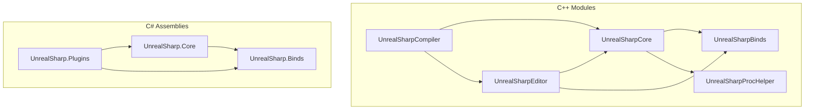

# UnrealSharp 插件全景图 - 当UE5遇见.NET

> **作者**：GLM-5.0

本系列将带你深入理解 UnrealSharp 插件的实现原理。作为开篇，我们先建立对插件整体架构的认知，理解它如何将 .NET 运行时嵌入到 UE5 中，实现 C# 游戏开发。

## 一、插件定位与核心价值

### 1.1 UnrealSharp 是什么？

UnrealSharp 是一个 UE5 插件，它让开发者能够使用 C# 编写游戏逻辑。它的核心描述是：

> "UnrealSharp is an extension to Unreal Engine 5 which enables developers to create games using C#."

这听起来简单，但实现这一目标需要跨越两大技术生态：

| 生态 | 技术栈 | 特点 |
|-----|--------|------|
| **UE5 原生层** | C++、蓝图、反射系统 | 手动内存管理、高性能、复杂的宏系统 |
| **.NET 托管层** | C#、CoreCLR/Mono | 自动垃圾回收、快速迭代、丰富的生态系统 |

UnrealSharp 的核心使命就是**搭建这两大生态之间的桥梁**。

### 1.2 为什么要在 UE 中使用 C#？

这是一个值得思考的问题。UE 已经有 C++ 和蓝图两套开发方式，为什么还需要 C#？

**开发效率**：
- C# 的语法简洁，避免了 C++ 的头文件、内存管理等复杂性
- 热重载支持：修改 C# 代码后无需重启编辑器即可生效
- 强大的 IDE 支持：Visual Studio、Rider 对 C# 的支持远超 C++

**生态优势**：
- NuGet 包生态：海量第三方库可直接使用
- 语言特性：LINQ、async/await、记录类型等现代语言特性

**团队协作**：
- 可以让熟悉 Unity/C# 的开发者快速上手 UE 项目
- 在大型项目中，可以用 C# 编写快速迭代的游戏逻辑，用 C++ 编写性能敏感的底层系统

### 1.3 UnrealSharp 的设计目标

从源码可以看出，UnrealSharp 的设计目标包括：

1. **双运行时支持**：同时支持 CoreCLR 和 Mono，适应不同平台需求
2. **完整反射集成**：C# 类型可以注册为 UE 的 UClass/UStruct，与蓝图无缝交互
3. **热重载**：支持运行时重新加载程序集，无需重启编辑器
4. **跨平台**：支持 Win64、Mac、Android、iOS

---

## 二、整体架构图解

### 2.1 三层架构模型

UnrealSharp 采用经典的**三层架构**设计：

```
┌─────────────────────────────────────────────────────────────────────────┐
│                          用户代码层                                      │
│  ┌─────────────────────────────────────────────────────────────────┐   │
│  │  用户 C# 项目 (如 ManagedSharpDemo)                              │   │
│  │  - 游戏逻辑代码                                                  │   │
│  │  - 继承自生成的基类                                              │   │
│  └─────────────────────────────────────────────────────────────────┘   │
└─────────────────────────────────────────────────────────────────────────┘
                                    │
                                    ▼
┌─────────────────────────────────────────────────────────────────────────┐
│                          托管桥梁层 (C#)                                 │
│  ┌──────────────────┐  ┌──────────────────┐  ┌──────────────────┐     │
│  │ UnrealSharp.Core │  │ UnrealSharp.Plugins│  │UnrealSharp.Binds │     │
│  │ - UnrealSharpObject│ │ - PluginLoader   │  │ - NativeBinds    │     │
│  │ - UnmanagedCallbacks│ │ - Main (入口点) │  │ - 函数绑定       │     │
│  │ - GCHandle工具    │  └──────────────────┘  └──────────────────┘     │
│  └──────────────────┘                                                    │
└─────────────────────────────────────────────────────────────────────────┘
                                    │
                          GCHandle / 函数指针
                                    │
                                    ▼
┌─────────────────────────────────────────────────────────────────────────┐
│                          原生桥梁层 (C++)                                │
│  ┌──────────────────┐  ┌──────────────────┐  ┌──────────────────┐     │
│  │UnrealSharpCore   │  │UnrealSharpBinds  │  │UnrealSharpEditor │     │
│  │ - CSManager      │  │ - CSBindsManager │  │ - 编辑器集成     │     │
│  │ - FGCHandle      │  │ - 函数导出宏     │  │ - 热重载         │     │
│  │ - 程序集管理      │  └──────────────────┘  └──────────────────┘     │
│  └──────────────────┘                                                    │
└─────────────────────────────────────────────────────────────────────────┘
                                    │
                                    ▼
┌─────────────────────────────────────────────────────────────────────────┐
│                          运行时层                                        │
│  ┌──────────────────────────┐    ┌──────────────────────────┐          │
│  │     CoreCLR              │    │       Mono               │          │
│  │  - hostfxr               │    │  - mono_jit_init         │          │
│  │  - runtimeconfig.json    │    │  - MonoDomain            │          │
│  │  - .NET 6+               │    │  - .NET Framework 4.x    │          │
│  └──────────────────────────┘    └──────────────────────────┘          │
└─────────────────────────────────────────────────────────────────────────┘
```

### 2.2 各层职责

| 层级 | 职责 | 关键技术 |
|-----|------|---------|
| **用户代码层** | 开发者编写的游戏逻辑 | C# 类继承、特性标注 |
| **托管桥梁层** | 封装互操作细节、管理对象生命周期 | GCHandle、UnmanagedCallersOnly |
| **原生桥梁层** | 对接 UE 反射系统、导出原生函数 | UObject、UFUNCTION、动态类型注册 |
| **运行时层** | 执行 C# 代码 | CoreCLR / Mono 嵌入 API |

---

## 三、模块划分速览

### 3.1 C++ 模块结构

从 `UnrealSharp.uplugin` 可以看到插件的模块定义：

```json
"Modules": [
    {"Name": "UnrealSharpCore",       "Type": "Runtime",     "LoadingPhase": "PostDefault"},
    {"Name": "UnrealSharpProcHelper", "Type": "Runtime",     "LoadingPhase": "PostDefault"},
    {"Name": "UnrealSharpEditor",     "Type": "Editor",      "LoadingPhase": "PostDefault"},
    {"Name": "UnrealSharpCompiler",   "Type": "Editor",      "LoadingPhase": "Default"},
    {"Name": "UnrealSharpBinds",      "Type": "Runtime",     "LoadingPhase": "Default"},
    {"Name": "UnrealSharpAsyncBlueprint", "Type": "UncookedOnly", "LoadingPhase": "PostDefault"},
    {"Name": "UnrealSharpAsync",      "Type": "Runtime",     "LoadingPhase": "Default"},
    {"Name": "UnrealSharpRuntimeGlue", "Type": "Editor",     "LoadingPhase": "Default"}
]
```

#### 核心模块详解

| 模块 | 类型 | 职责 |
|-----|------|------|
| **UnrealSharpCore** | Runtime | 中央管理器，运行时初始化，程序集管理，对象生命周期同步 |
| **UnrealSharpBinds** | Runtime | 原生函数导出，`UNREALSHARP_FUNCTION` 宏定义 |
| **UnrealSharpProcHelper** | Runtime | 进程工具，路径解析，C# 编译器调用 |
| **UnrealSharpEditor** | Editor | 编辑器集成，热重载，蓝图支持，菜单扩展 |
| **UnrealSharpCompiler** | Editor | 蓝图编译器扩展，C# 类型的蓝图编译支持 |
| **UnrealSharpRuntimeGlue** | Editor | 运行时胶水代码生成触发器 |
| **UnrealSharpAsync** | Runtime | 异步操作支持 |
| **UnrealSharpAsyncBlueprint** | UncookedOnly | 异步蓝图节点 |

#### 特殊模块：UnrealSharpManagedGlue

这个模块没有 `Build.cs` 文件，因为它是一个 **UBT 插件**（Unreal Build Tool Plugin）：

```
Source/UnrealSharpManagedGlue/
├── CSharpExporter.cs      # 导出入口
├── Program.cs             # UBT 插件入口
├── Exporters/             # 各类型导出器
└── PropertyTranslators/   # 属性类型翻译器
```

它的作用是在 UHT（Unreal Header Tool）运行时，解析 C++ 头文件并生成对应的 C# 绑定代码。

### 3.2 C# 项目结构

从 `Managed/UnrealSharp/` 目录可以看到 C# 侧的组织：

```
Managed/UnrealSharp/
├── UnrealSharp.sln                    # 解决方案文件
├── UnrealSharp.Core/                  # 核心运行时
│   ├── UnrealSharpObject.cs          # 所有 C# UObject 的基类
│   ├── UnmanagedCallbacks.cs         # 导出给 C++ 调用的回调函数
│   ├── GCHandleUtilities.cs          # GCHandle 工具类
│   └── Attributes/                   # 特性定义（UClass, UFunction 等）
├── UnrealSharp.Plugins/              # 插件加载器
│   ├── Main.cs                       # 初始化入口
│   └── PluginLoader.cs               # 程序集加载/卸载
├── UnrealSharp.Binds/                # 原生函数绑定
├── UnrealSharp.SourceGenerators/     # Roslyn 源码生成器
├── UnrealSharp.Analyzers/            # Roslyn 分析器
└── UnrealSharp/                      # 用户 API 层
    ├── Array.cs, Map.cs, Set.cs     # 集合类型封装
    ├── Delegate.cs                   # 委托系统
    └── SoftObject.cs                 # 软引用
```

### 3.3 模块依赖关系



---

## 四、数据流全景图

### 4.1 编辑器编译流程

当你在 UE 编辑器中点击"编译"时，发生了什么？

```
┌─────────────────────────────────────────────────────────────────────┐
│                        编辑器编译流程                                │
└─────────────────────────────────────────────────────────────────────┘

1. UBT 启动
   │
   ▼
2. UHT 解析 C++ 头文件
   │  - 解析 UCLASS, UPROPERTY, UFUNCTION 等宏
   │  - 生成反射代码
   ▼
3. UnrealSharpManagedGlue (UBT 插件) 运行
   │  - CSharpExporter.StartExport()
   │  - 遍历所有 UhtModule 和 UhtPackage
   │  - 调用 ClassExporter, StructExporter 等
   ▼
4. 生成 C# 绑定代码
   │  - 输出到项目的 Script/<ProjectName>.RuntimeGlue/
   │  - 包含所有 UE 类型的 C# 封装
   ▼
5. 调用 dotnet build 编译 C# 项目
   │  - 编译用户的 C# 代码
   │  - 编译生成的绑定代码
   ▼
6. 生成程序集 (.dll)
   │
   ▼
7. 编辑器加载程序集
```

### 4.2 运行时初始化流程

游戏启动时，运行时如何初始化？

```
┌─────────────────────────────────────────────────────────────────────┐
│                        运行时初始化流程                              │
└─────────────────────────────────────────────────────────────────────┘

1. UE 引擎初始化
   │
   ▼
2. 加载 UnrealSharpCore 模块 (PostDefault 阶段)
   │
   ▼
3. CSManager::InitializeDotNetRuntime()
   │  ├── [CoreCLR 路径]
   │  │   ├── 加载 hostfxr.dll
   │  │   ├── 初始化运行时配置
   │  │   └── 获取函数指针
   │  └── [Mono 路径]
   │      ├── mono_set_dirs()
   │      └── mono_jit_init()
   ▼
4. 调用 C# 入口点: Main.InitializeUnrealSharp()
   │  - 设置 AppDomain 基目录
   │  - 初始化回调指针
   │  - 注册托管回调函数
   ▼
5. 加载用户程序集
   │  - PluginLoader.LoadPlugin()
   │  - 扫描 [GeneratedType] 特性
   ▼
6. 注册 C# 类型到 UE 反射系统
   │  - UCSManagedAssembly.RegisterManagedType()
   │  - CSManagedClassCompiler.Recompile()
   │  - 创建 UClass/UStruct
   ▼
7. 运行时就绪，等待游戏逻辑执行
```

### 4.3 方法调用流程

当 C# 代码调用一个 UE 函数时：

```
┌─────────────────────────────────────────────────────────────────────┐
│                     C# → C++ 方法调用链                             │
└─────────────────────────────────────────────────────────────────────┘

C# 代码: actor.SetActorLocation(newLocation)
   │
   ▼
生成的 Glue 代码 (由 PropertyTranslator 生成)
   │  - 参数封送 (Vector → FVector)
   │  - 获取原生对象指针
   ▼
UNREALSHARP_FUNCTION 导出函数
   │  - UActorExporter.SetActorLocation()
   │  - 从 GCHandle 获取原生 UObject
   ▼
UE 原生实现
   │  - AActor::SetActorLocation()
   │
   ▼
返回值封送回 C#
```

当 C++ 调用 C# 方法时（如蓝图调用）：

```
┌─────────────────────────────────────────────────────────────────────┐
│                     C++ → C# 方法调用链                             │
└─────────────────────────────────────────────────────────────────────┘

UE 蓝图/原生代码触发
   │
   ▼
CSManager::InvokeManagedMethod()
   │  - 查找方法 (LookupManagedMethod)
   │  - 准备参数
   ▼
托管回调函数
   │  - InvokeManagedMethod (UnmanagedCallbacks.cs)
   │  - 使用反射或预编译的委托调用
   ▼
C# 方法执行
   │
   ▼
返回值处理
   │  - 值类型需要 unbox
   │  - 引用类型需要创建 GCHandle
   ▼
返回给 C++
```

---

## 五、与 UE 原生开发方式的对比

### 5.1 三种开发方式对比

| 特性 | C++ | 蓝图 | C# (UnrealSharp) |
|-----|-----|------|-----------------|
| **执行性能** | 最快 | 较慢（VM 解释） | 接近 C++（JIT 优化） |
| **开发效率** | 低 | 高（可视化） | 高 |
| **热重载** | 有限支持 | 完全支持 | 完全支持 |
| **调试体验** | 好 | 一般 | 优秀 |
| **学习曲线** | 陡峭 | 平缓 | 中等 |
| **跨语言调用** | 原生 | 支持 | 需要桥接层 |
| **平台支持** | 全平台 | 全平台 | 取决于运行时 |

### 5.2 适用场景建议

**C++ 适合**：
- 性能敏感的底层系统（渲染、物理、AI）
- 需要与原生库交互的场景
- 发布版本的最终优化

**蓝图适合**：
- 快速原型开发
- 关卡设计师的工作
- 简单的游戏逻辑

**C# (UnrealSharp) 适合**：
- 快速迭代的游戏逻辑
- 需要复杂算法但不需要极致性能
- 团队有 Unity/C# 背景
- 需要使用 .NET 生态库

### 5.3 混合开发模式

UnrealSharp 支持与 C++ 和蓝图混合使用：

```csharp
// C# 中继承 C++ 类
[UClass]
public partial class AScriptGameMode : AGameModeBase  // AGameModeBase 是 C++ 类
{
    public override void BeginPlay()  // 重写 C++ 虚函数
    {
        base.BeginPlay();
        // C# 逻辑
    }
}
```

```
蓝图可以：
- 调用 C# 中标记为 [UFunction] 的方法
- 继承 C# 定义的类
- 使用 C# 定义的属性
```

---

## 六、实际案例：你的第一个 C# GameMode

让我们看一个来自项目 `AScriptGameMode.cs` 的实际例子：

```csharp
using UnrealSharp;
using UnrealSharp.Attributes;
using UnrealSharp.Core;
using UnrealSharp.CoreUObject;
using UnrealSharp.Engine;

namespace ManagedSharpDemo
{
    [UClass]  // 标记为 UE 类
    public partial class AScriptGameMode : AGameModeBase  // 继承 C++ 的 AGameModeBase
    {
        public AScriptGameMode()
        {
            // 设置默认 Pawn 类
            DefaultPawnClass = typeof(AScriptCharacter);  // 用 C# typeof 获取 UClass
        }

        public override void BeginPlay()  // 重写 C++ 虚函数
        {
            base.BeginPlay();
            // 你的游戏逻辑
        }
    }
}
```

这段代码经过编译后：
1. `[UClass]` 特性会被扫描，生成对应的 UClass
2. 类会被注册到 UE 的反射系统
3. 蓝图可以选择这个 C# GameMode
4. `BeginPlay` 可以被 UE 的 C++ 代码调用

---

## 七、总结

### 7.1 架构设计要点

1. **分层清晰**：用户代码 → 托管桥梁 → 原生桥梁 → 运行时，职责分明
2. **双运行时支持**：通过编译宏 `UNREALSHARP_MONO` 切换 CoreCLR 和 Mono
3. **代码生成驱动**：UHT 插件自动生成绑定代码，减少手动工作
4. **完整反射集成**：C# 类型可以注册为 UE 类型，实现双向交互

### 7.2 关键技术点预告

在后续文章中，我们将深入探讨：

| 篇章 | 核心问题 |
|-----|---------|
| 运行时初始化 | CoreCLR/Mono 如何被嵌入到 UE 进程中？ |
| GCHandle 管理 | C# 对象和 UObject 如何保持生命周期同步？ |
| Glue 代码生成 | C++ 类型如何自动映射到 C# 类型？ |
| 动态类型注册 | C# 类如何"变"成 UE 的 UClass？ |
| 函数导出系统 | C# 如何调用 UE 的海量 C++ API？ |

---

## 参考资料

- [UnrealSharp GitHub](https://github.com/UnrealSharp/UnrealSharp)
- [.NET Runtime Embedding](https://docs.microsoft.com/en-us/dotnet/core/tutorials/netcore-hosting)
- [Mono Embedding](https://www.mono-project.com/docs/advanced/embedding/)

---

*下一篇：深入理解 .NET 运行时嵌入 - CoreCLR 与 Mono 的初始化之道*
